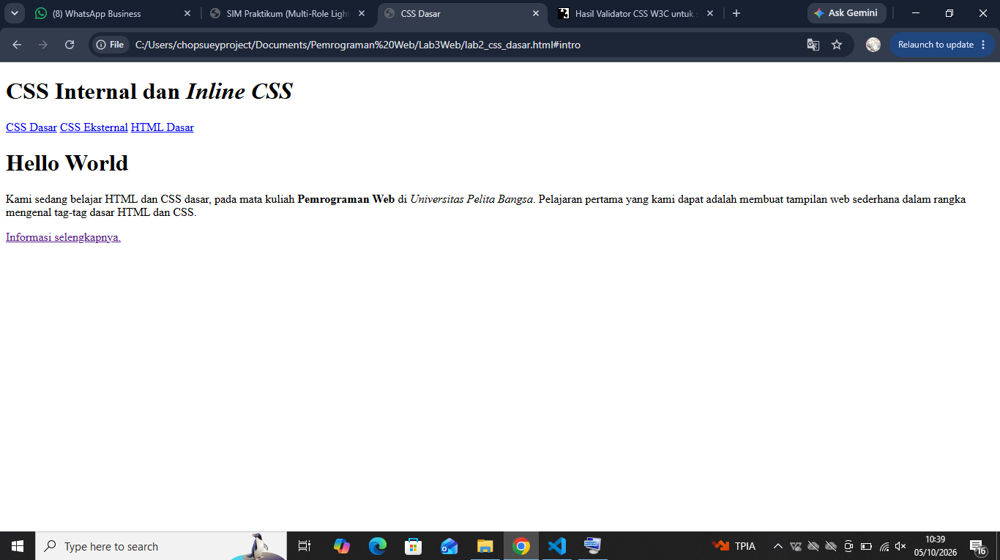
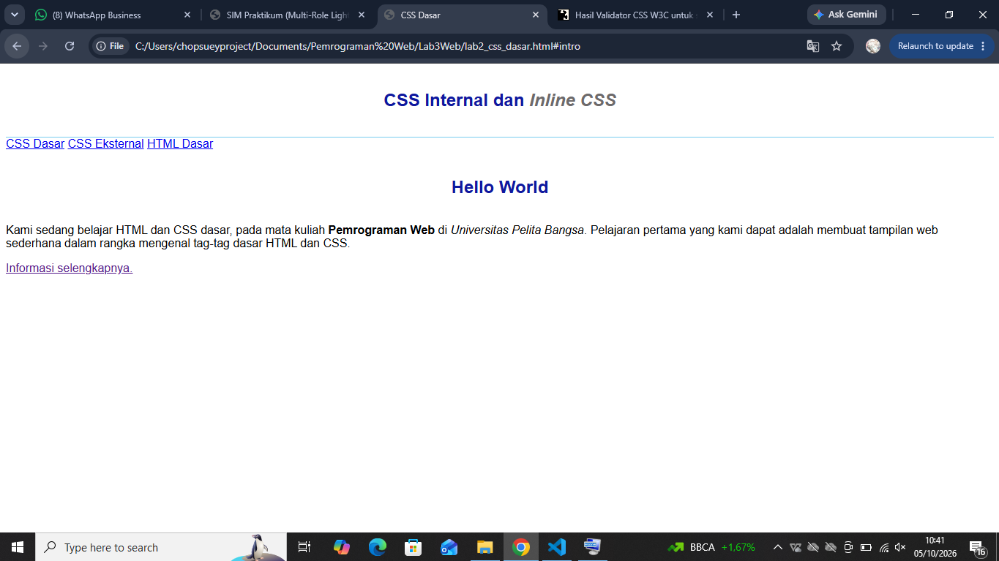
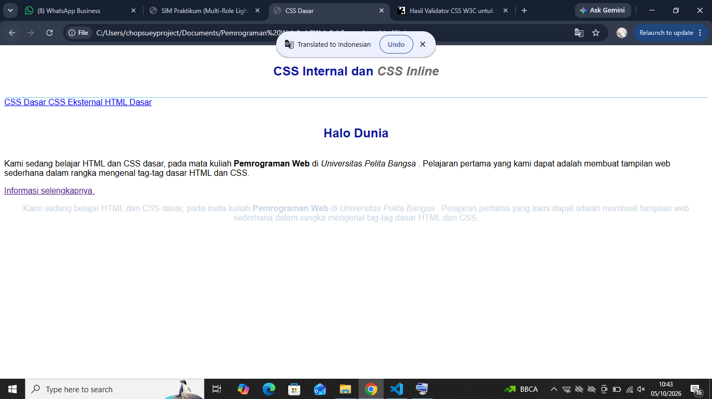
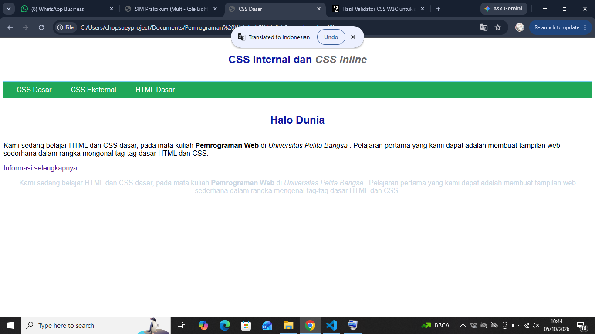
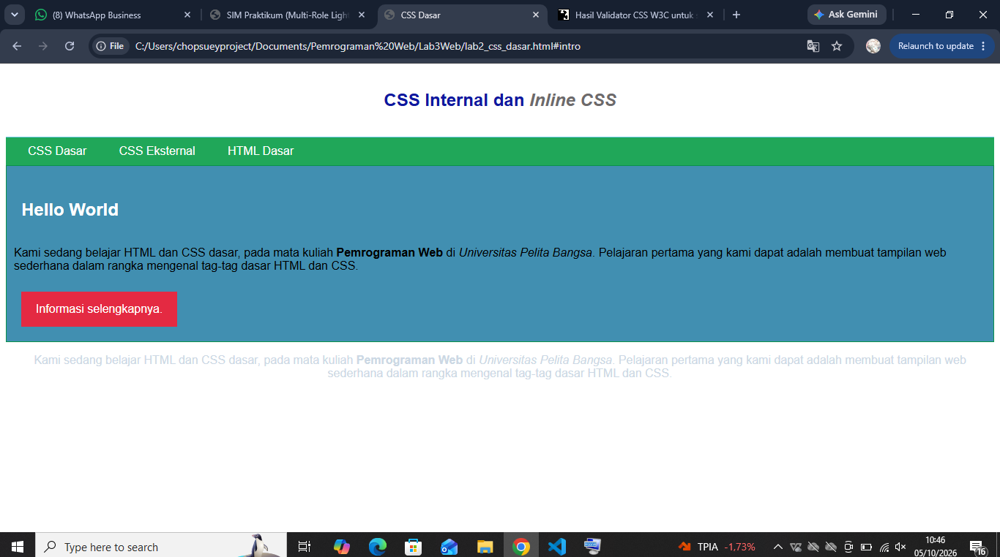

# Praktikum 3: CSS Dasar

**Nama:** Alfy Ramadhan
**Program Studi:** Teknik Informatika — Universitas Pelita Bangsa
**Mata Kuliah:** Pemrograman Web

## Langkah-langkah Praktikum

### 1. Membuat Dokumen HTML
Membuat struktur dasar HTML dengan header, nav, dan div id="intro" berisi konten.

### 2. CSS Internal
Menambahkan `<style>` di `<head>` untuk mengatur font, header, dan h1.

### 3. Inline CSS
Menambahkan atribut `style` langsung pada tag `
`.

### 4. CSS Eksternal
Membuat file `style_eksternal.css` terpisah dan menghubungkannya lewat tag `<link>`.

### 5. CSS Selector (ID dan Class)
Menambahkan selector `#intro`, `#intro h1`, `.button`, dan `.btn-primary`.

## Jawaban Pertanyaan

**2. Apa perbedaan `h1 {...}` dengan `#intro h1 {...}`?**

`h1` adalah elemen selector yang berlaku untuk semua tag h1 di halaman. Sedangkan `#intro h1` hanya berlaku untuk h1 yang ada di dalam elemen ber-id `intro`. Karena lebih spesifik, aturan `#intro h1` menang dibanding `h1` biasa.

**3. Deklarasi mana yang ditampilkan jika ada CSS internal, eksternal, dan inline pada elemen yang sama?**

Inline selalu menang karena ditulis langsung di tag HTML. Antara internal dan eksternal, yang menang adalah yang posisinya paling akhir dibaca browser. Pada praktikum ini, link eksternal ditulis setelah style internal, jadi eksternal menang kalau ada aturan yang sama.

**4. Deklarasi mana yang ditampilkan jika elemen punya ID dan Class sekaligus?**

ID selector menang dibanding class selector, karena ID punya bobot (specificity) lebih tinggi. Contoh: `
` akan memakai warna dari `#paragraf-1`, bukan dari `.text-paragraf`.